# 🐍 Python Programming - Complete Study Notes


**Comprehensive reference guide for Python fundamentals.**

---

## 📑 Table of Contents

1. [Print Function](#1-print-function)
2. [Data Types](#2-data-types)
3. [Variables](#3-variables)
4. [Keywords and Identifiers](#4-keywords-and-identifiers)
5. [Indentation](#5-indentation)
6. [User Input](#6-user-input)
7. [Type Conversion](#7-type-conversion)
8. [Literals](#8-literals)
9. [Operators](#9-operators)
10. [Conditional Statements](#10-conditional-statements)
11. [Loops](#11-loops)
12. [Exercises](#12-exercises)
13. [Projects](#13-projects)

---

## 🖨️ 1. Print Function

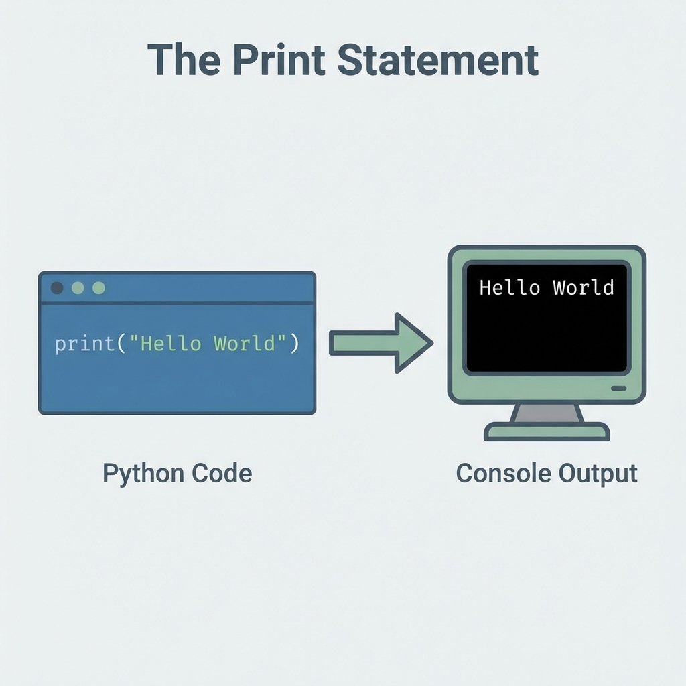

### Overview

The `print()` function is the first command every programmer learns. It allows your program to "speak" by displaying text, numbers, or other data to the console. Whether you are debugging code or showing results to a user, `print()` is your primary tool for output.

It converts the objects you pass into strings and writes them to the standard output stream.

**Syntax:**
```python
print(*objects, sep=' ', end='\n', file=sys.stdout, flush=False)
```

### Basic Usage

**Printing strings:**
```python
print('Hello World')
```
**Output:**
```
Hello World
```

---

## 📦 2. Data Types

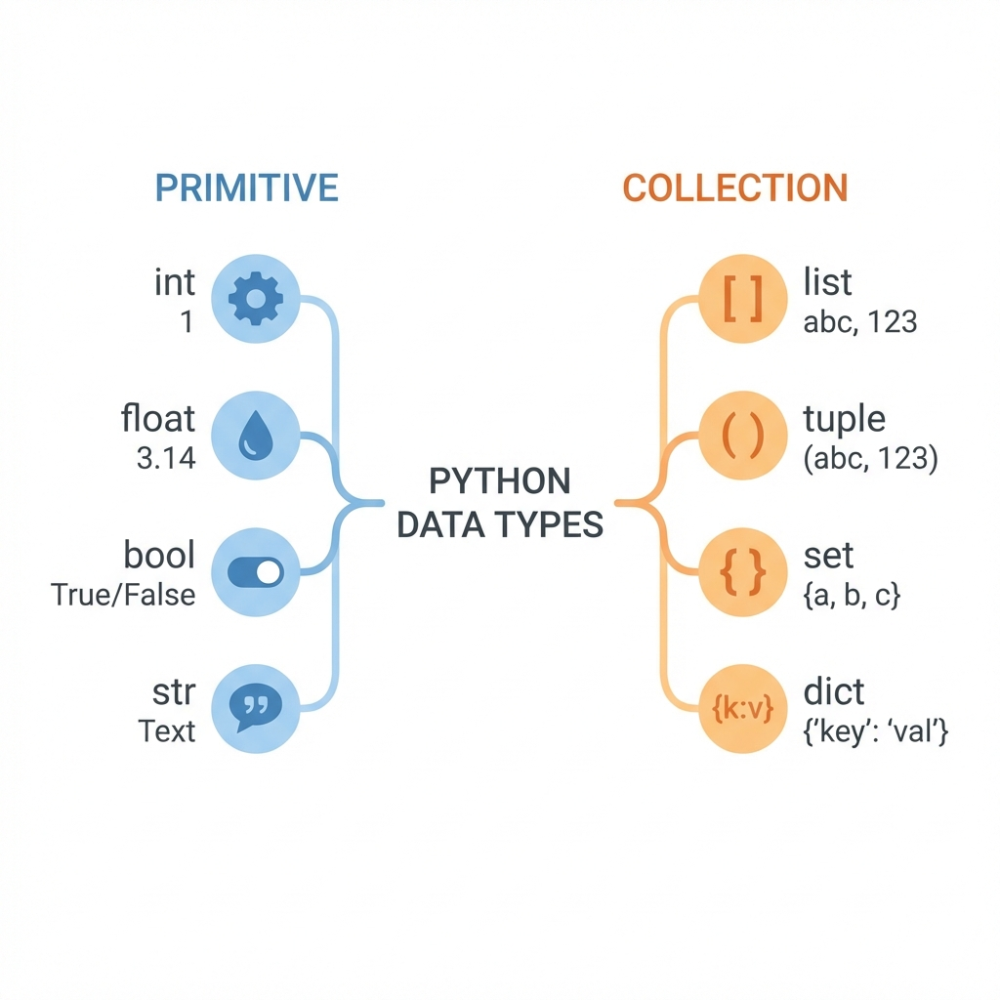

### Overview

In programming, data comes in various forms—numbers, text, true/false values, and more. Data types tell Python explicitly how to treat a piece of data. Understanding these is crucial because you can't allow operations like adding a number to a word!

Python has several built-in standard types that you will use frequently:

### 1. None Type (`None`)
Represents the absence of a value or a null value. It is not 0 or an empty string, it is literally "nothing".

```python
x = None
print(type(x)) # <class 'NoneType'>
```

### 2. Numeric Types
*   **int**: Whole numbers (e.g., `10`, `-5`).
*   **float**: Decimal numbers (e.g., `3.14`, `1.5e2`).
*   **complex**: Numbers with real and imaginary parts (e.g., `3 + 4j`).

### 3. Sequence Types
*   **str**: Text data (string of characters).
*   **list**: Ordered, mutable collection. `[1, 2, 3]`
*   **tuple**: Ordered, immutable collection. `(1, 2, 3)`
*   **range**: Sequence of numbers, used in loops.

### 4. Mapping Type
*   **dict**: Key-value pairs. `{'name': 'Vishnu', 'age': 25}`

### 5. Set Types
*   **set**: Unordered collection of unique items. `{1, 2, 3}`
*   **frozenset**: Immutable version of a set.

### 6. Boolean Type
*   **bool**: `True` or `False`.

> [!NOTE]
> Python is dynamically typed, so you don't need to declare types explicitly. The interpreter infers them.

---

## 🏷️ 3. Variables

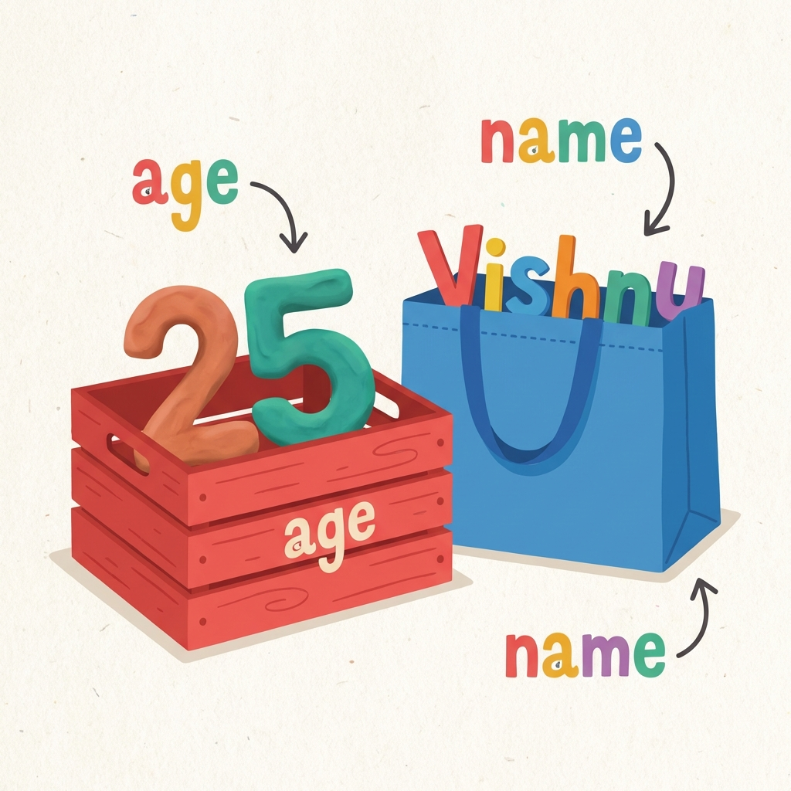

### Definition

Think of variables as labeled boxes in a warehouse. You can put data inside a box, and whenever you need it, you just look for the label (variable name). Variables allow you to store, update, and retrieve data throughout your program's lifecycle.

Technically, they are references to memory locations where the actual values are stored.

```python
name = 'Vishnu'
age = 25
height = 5.9
```

### Dynamic Typing
Variables can change type during execution.

```python
var = 10        # int
var = "Hello"   # Now str
```

---

## 🔑 4. Keywords and Identifiers

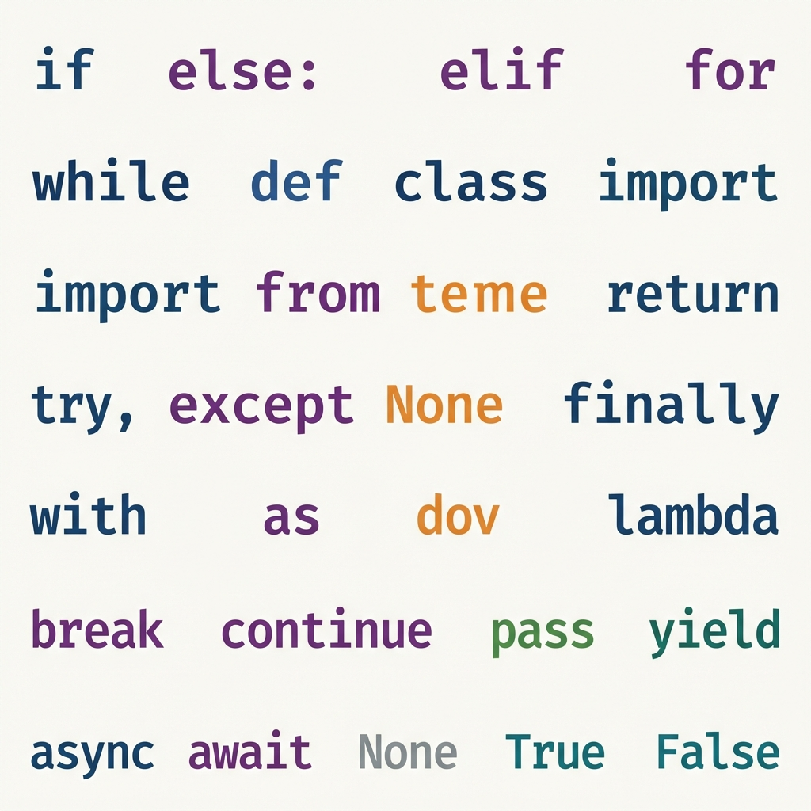

### 1. Keywords
Every language has its own grammar rules. **Keywords** are Python's reserved vocabulary—words that have special meaning to the interpreter (like command words). You cannot use them as variable names because Python uses them to understand the structure of your code.

### 2. Identifiers
Identifiers are the names you give to your entities—variables, functions, classes, etc. They are how you "identify" different parts of your code.
Names given to variables, functions, and classes.
*   Must start with a letter or `_`.
*   Case-sensitive (`Age` vs `age`).
*   Cannot be a keyword.

---

## 📏 5. Indentation

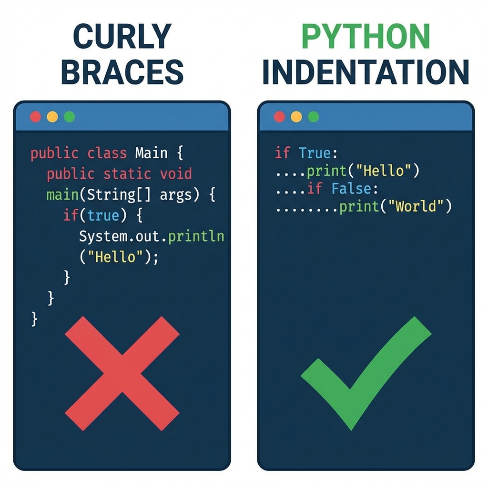

### Overview
### Why is it important?
In many programming languages, brackets `{}` are used to define blocks of code. Python is unique (and cleaner) because it uses **whitespace indentation** to define scope. This forces you to write readable code. If your indentation is inconsistent, Python will raise an error.

Indentation is not just for style in Python—it is a **syntax requirement**.

**Correct Syntax:**
```python
if True:
    print("This is indented")
    print("Part of the block")
```

**Common Error (`IndentationError`):**
```python
if True:
print("Missing indentation!") # Error!
```

---

## ⌨️ 6. User Input

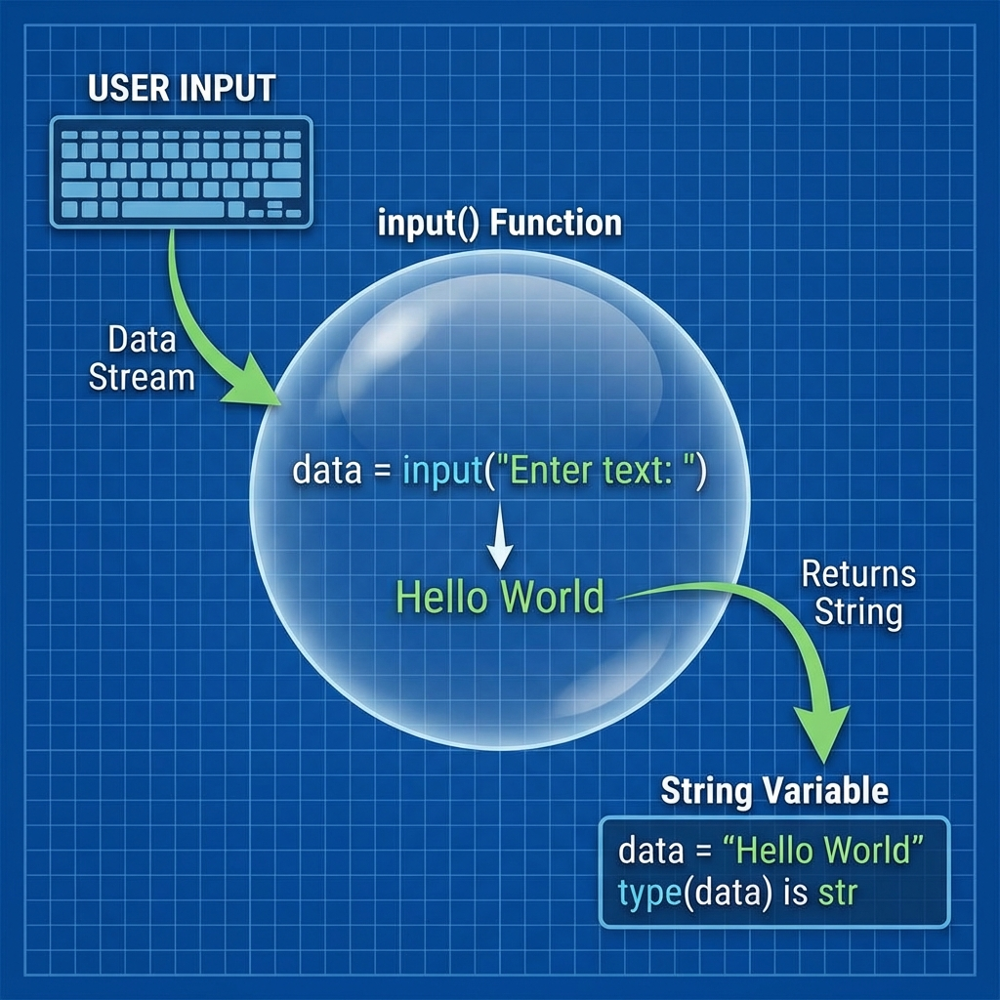

### Overview
### Interactive Programs
Static programs are boring. The `input()` function pauses your program and waits for the user to type something on the keyboard. It enables interactivity, allowing you to build everything from text-based games to data entry forms.

**Important:** The input is *always* read as a **string**, even if the user types a number.

```python
name = input('Enter your name: ')
age = int(input('Enter your age: ')) # Convert to int
```

---

## 🔄 7. Type Conversion

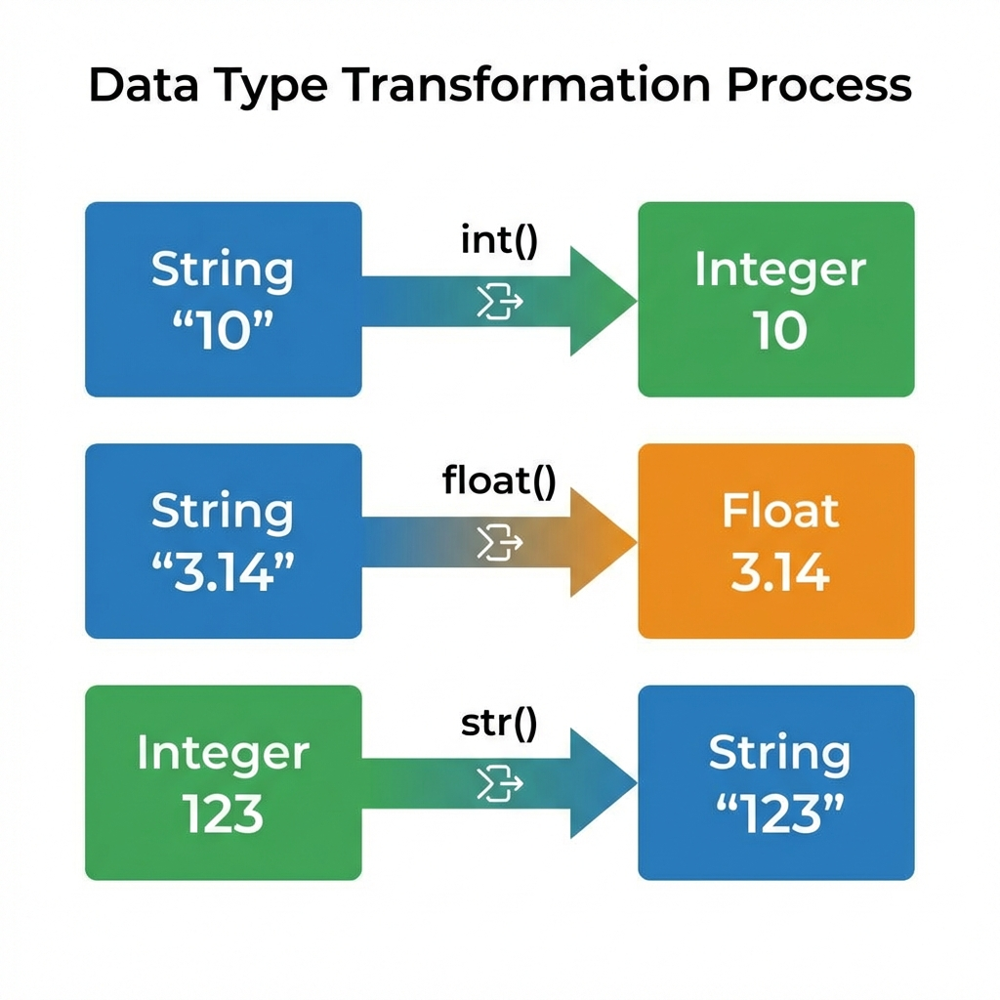

### Changing Data Forms
Sometimes you have a number preserved as a string (e.g., from user input) but need to do math with it. Type conversion (or "casting") allows you to manually transform data from one type to another.

*   **Implicit Conversion**: Python automatically converts smaller types to larger types (e.g., `int` to `float` during division) to prevent data loss.
*   **Explicit Conversion**: You manually force the change using functions like `int()`, `str()`, or `list()`.

```python
s = "100"
n = int(s) # String to Integer
```

---

## 🧱 8. Literals

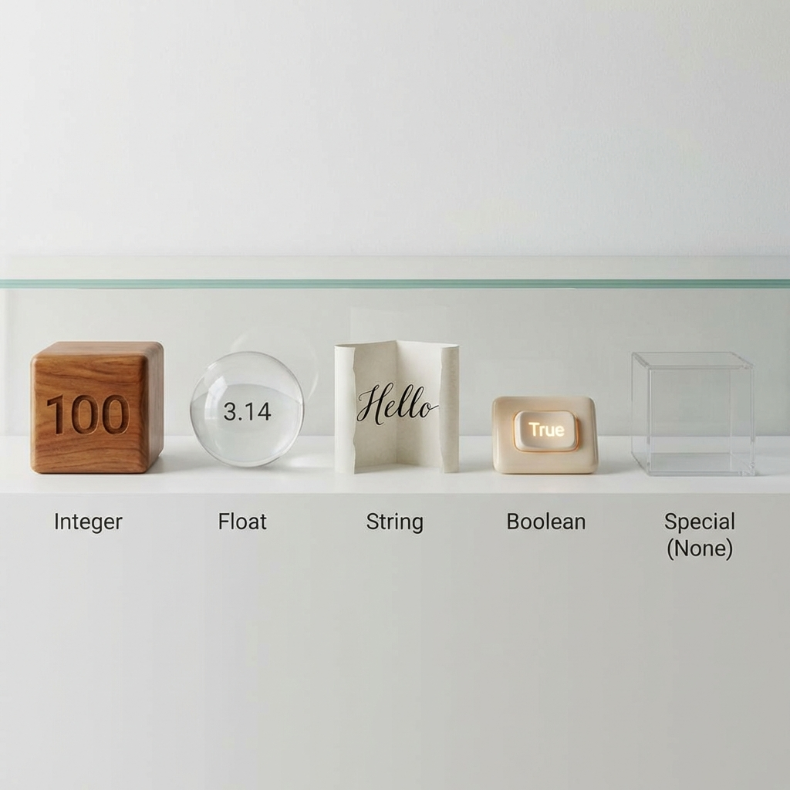

### Definition
### What are Literals?
Literals are the raw, fixed values you type directly into your code. When you type `10` or `"Hello"`, those are literals—data that is literally written out. They are the building blocks that you assign to variables.

*   **Numeric**: `100`, `3.14`
*   **String**: `'Hello'`, `"World"`
*   **Boolean**: `True`, `False`
*   **Special**: `None`

---

## ➕ 9. Operators

*No graphic available*

### Overview
Operators are the symbols that tell the machine to perform specific mathematical, relational, or logical computations. They are the engines that drive the processing of data.

*   **Arithmetic**: Basic math (`+`, `-`, `*`, `/`, `%`) and powers (`**`).
*   **Assignment**: storing values (`=`, `+=`).
*   **Comparison**: testing equality or size (`==`, `>`, `<`).
*   **Logical**: making complex decisions (`and`, `or`, `not`).

---

## 🚦 10. Conditional Statements

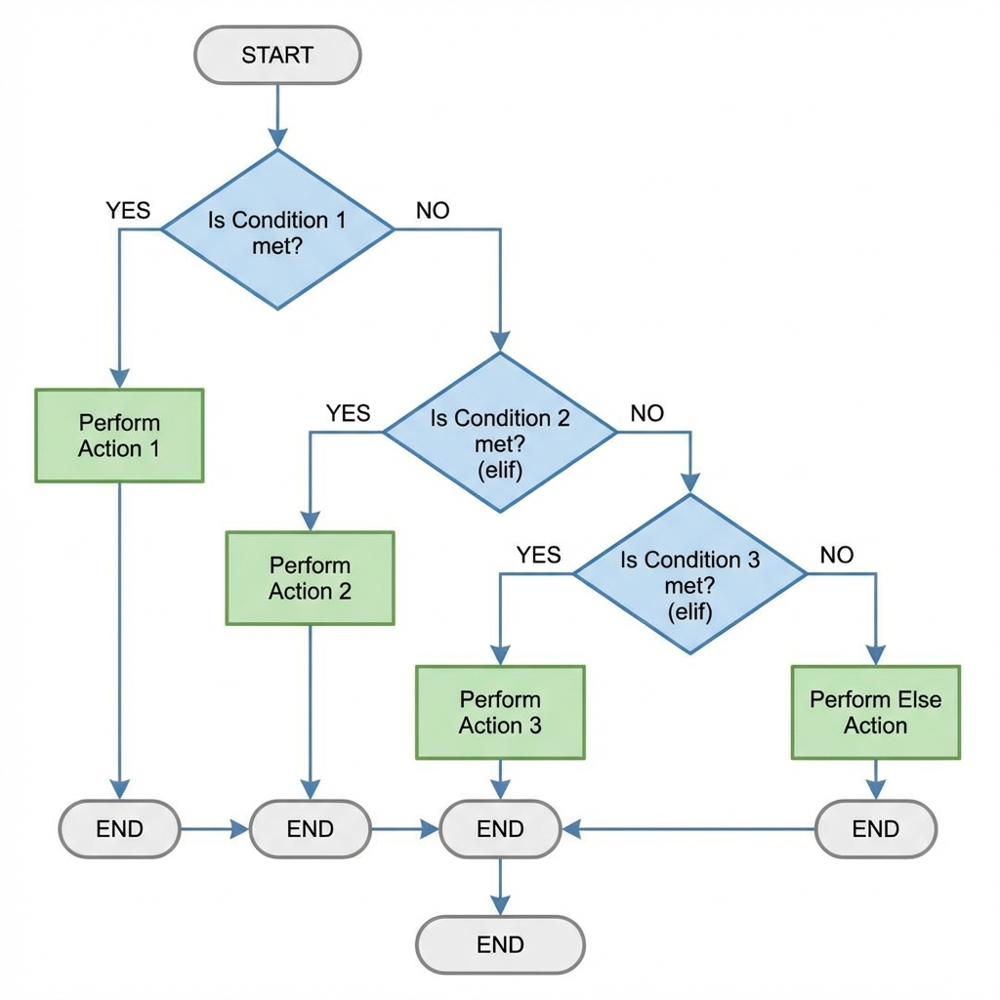

### Making Decisions
Code doesn't always run in a straigh line. **Conditional statements** allow your program to branch and take different paths based on whether certain conditions are `True` or `False`. This allows your program to react intelligently to different inputs.

### Logic Flow

```python
age = 20

if age >= 18:
    print("Adult")
elif age > 12:
    print("Teenager")
else:
    print("Child")
```

---

## 🔁 11. Loops

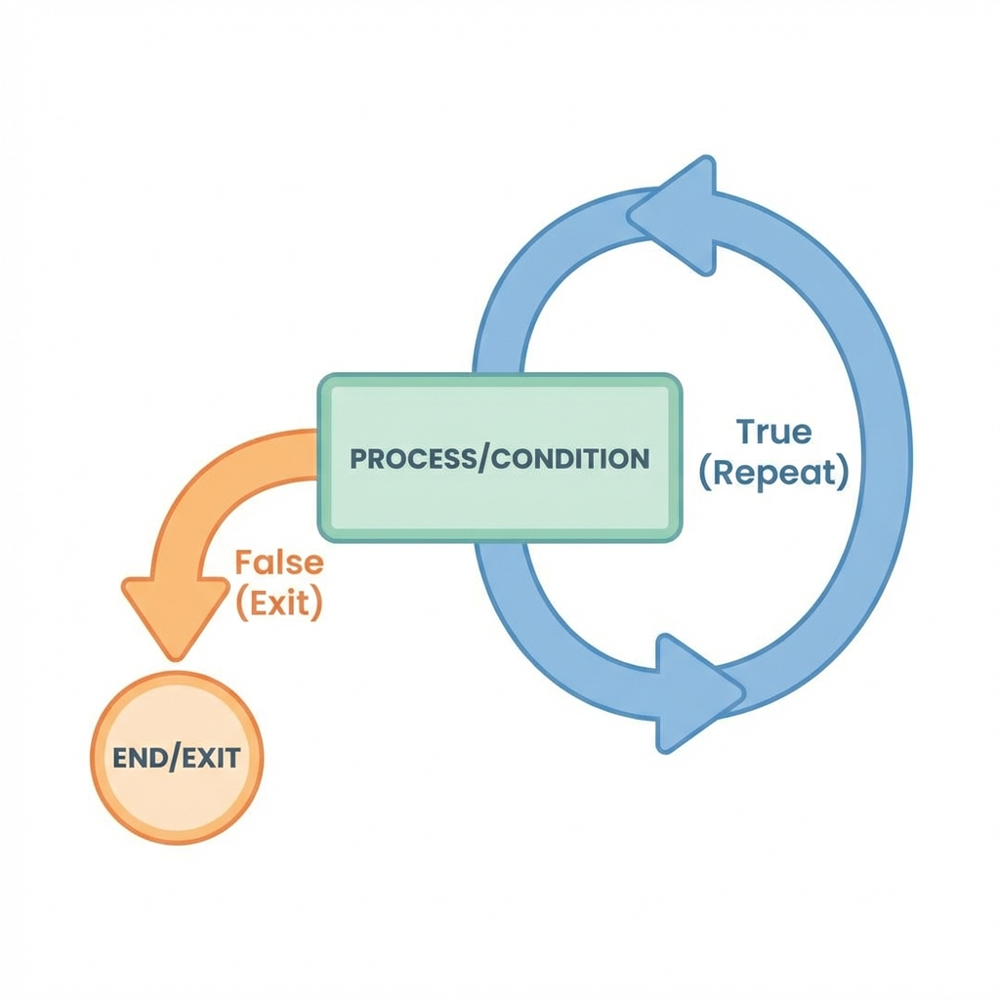

### Overview
### The Power of Repetition
Computers are excellent at doing boring, repetitive tasks without complaining. **Loops** allow you to execute a block of code multiple times efficiently. Instead of writing `print()` 100 times, you can write a loop in 3 lines.

### `while` Loop
Repeats as long as a condition is true.

```python
count = 0
while count < 5:
    print(count)
    count += 1
```

### `for` Loop
Iterates over a sequence.

**Iterating a List:**
```python
fruits = ["apple", "banana"]
for fruit in fruits:
    print(fruit)
```

**Iterating a Dictionary:**
```python
person = {'name': 'Vishnu', 'age': 25}
for key, value in person.items():
    print(key, value)
```

**Using `enumerate()`:**
```python
for index, fruit in enumerate(fruits):
    print(f"{index}: {fruit}")
```

### Real-world Example: E-commerce Display

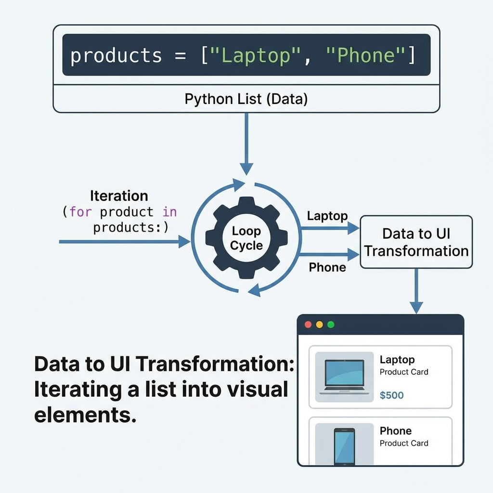

```python
products = [{'name': 'Laptop', 'price': 999}, {'name': 'Phone', 'price': 499}]
for product in products:
    print(f"Item: {product['name']} - ${product['price']}")
```

---

## 🏋️ 12. Exercises

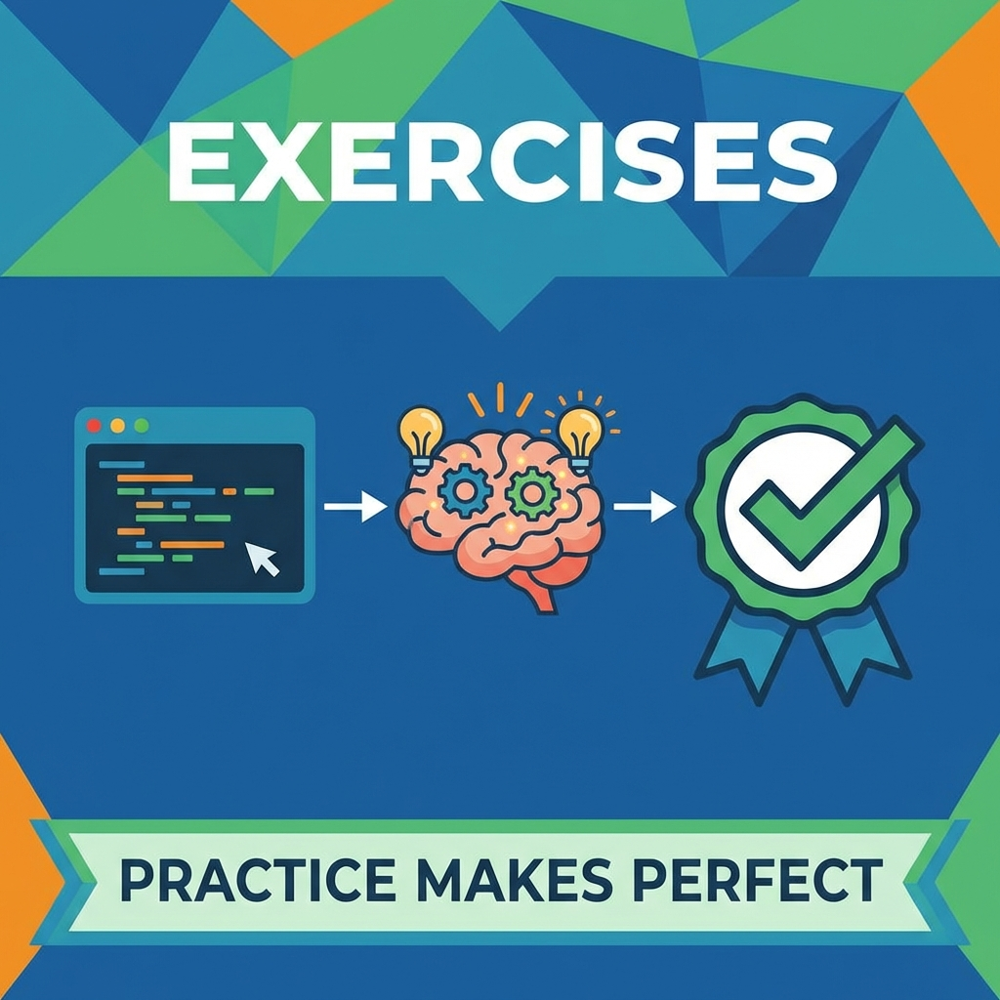

### Practice Makes Perfect
The best way to learn programming is to *code*. These exercises are designed to test your understanding of the concepts above. Try to solve them without looking at the solutions first!

### Set 1: Basics
1.  Print your bio using `print()`.
2.  Calculate simple math using operators.

### Set 2: Logic
1.  Write a grade calculator using `if-elif-else`.
2.  Create a loop that prints even numbers from 1 to 20.

---

## 🚀 13. Projects

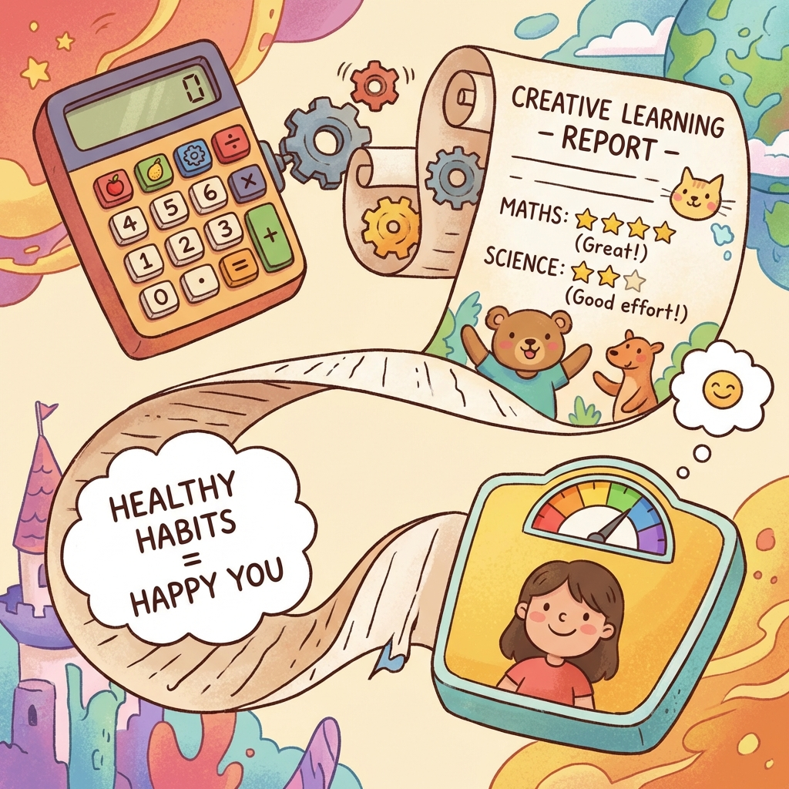

### Building Real Things
Now that you have the tools, it's time to build complete programs. These projects combine multiple concepts (loops, logic, input) to solve real problems.

### Project 1: Calculator
Simple arithmetic operations based on user choice.

### Project 2: Grade Analyzer
Takes 5 subject marks and calculates average/grade.

### Project 3: BMI Calculator
Calculates Body Mass Index from height and weight.

### Project 4: Number Guessing Game 🕵️


**Description**: The computer picks a number (1-100). run infinite loop until you guess it.

```python
import random

print("="*40)
print("     NUMBER GUESSING GAME")
print("="*40)

secret = random.randint(1, 100)
attempts = 0

print("I picked a number (1-100). Guess it!")

while True:
    try:
        guess = int(input(f"Attempt {attempts+1}: "))
        attempts += 1
        
        if guess == secret:
            print(f"🎉 Correct! You won in {attempts} attempts.")
            break
        elif guess < secret:
            print("To Low!")
        else:
            print("Too High!")
    except ValueError:
        print("Please enter a valid number.")
```

---
*End of Complete Python Notes*
